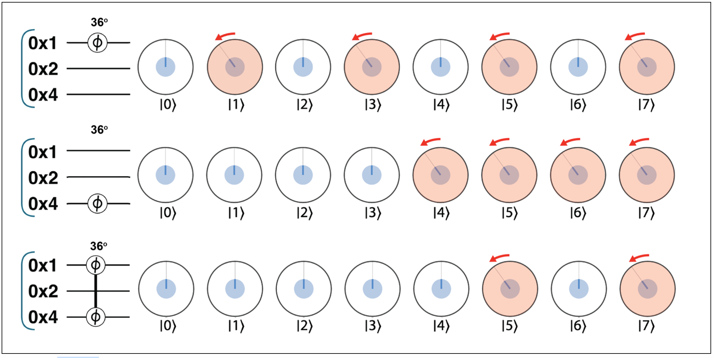
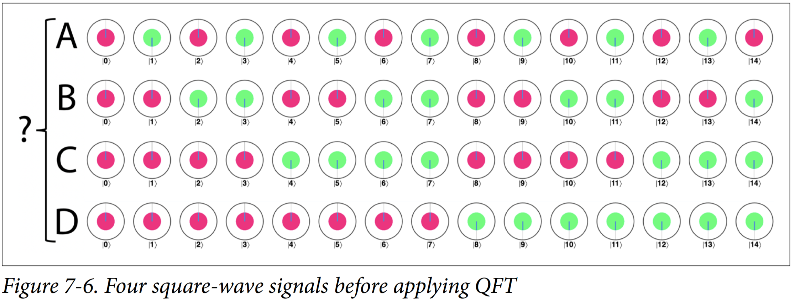
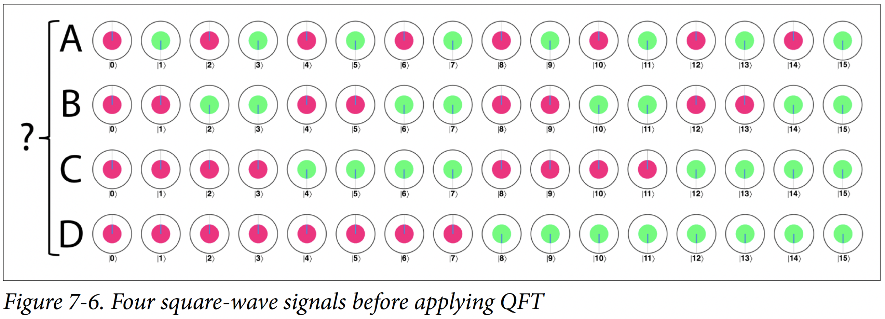
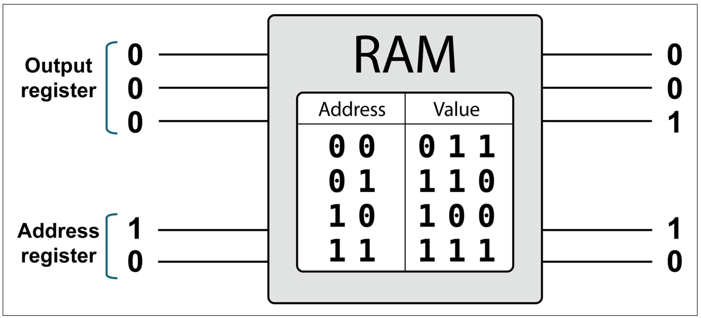
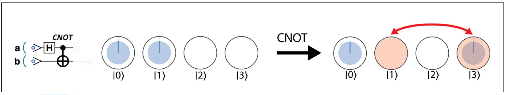

## Programming Quantum Computers: Errata

This document contains information about errors we've identified in the book's first edition. If you have more, please feel free to contact us [via email](octopus@machinelevel.com) or by logging a [Github issue](https://github.com/oreilly-qc/oreilly-qc.github.io/issues)! Many thanks from EJ, Nic and Mercedes.

### Table 2-2
*Thanks to Haeil Yi for pointing this out!* The value 0.35 in the fourth row of the table should be 0.31

### Example 2-3
*Thanks to checky2010 (Jonas) for pointing this out!* The sign of the `phase(90)` operation doesn't match the sign of the online example `phase -90`. This is also an issue in Figure 2-16 and Figure 2-18. Might be good to add a note that the operation works eiother way, so long as you're consistent.

### Page 32: Spy Hunter
*Thanks to Mariia at Microsoft for pointing out this one, and to Cláudio Gomes at Universidade de Coimbra for additional correction!*

> **Incorrect**: "Any spy who tries to read one of these qubits has a <mark>25%</mark> chance of getting caught. So even if Alice and Bob only use 50 of them in the whole transfer, the spy’s chances of getting away are far less than one in a million."

> **Corrected**: "Any spy who tries to read one of these qubits has a <mark>12.5%</mark> chance of getting caught. So even if Alice and Bob only use 100 of them in the whole transfer, the spy’s chances of getting away are close to one in a million."

### Page 28: QPU Instruction: PHASE(θ)
*Thanks to Dr. Moez AbdelGawad at Rice University for spotting this!*

> **Incorrect**: "These four states will be used in Example 2-4"

> **Corrected**: "Some of these states will be used in Example 2-4"

### Page 35: Spy Hunter
*Thanks to Dr. Moez AbdelGawad at Rice University for spotting this!*

> **Incorrect**: "She sets it to `value`, ..."

> **Corrected**: "She sets it to `send_val`, ..."

### Page 40: Drawing a Multi-Qubit Register
*Thanks to Dr. Moez AbdelGawad at Rice University for spotting this!*

> **Incorrect**: "... the random eight-qubyte circuit ..."

> **Corrected**: "... the random eight-qubit circuit ..."

### Text for Example 3-6: Hands-on: Remote-Controlled Randomness
*Thanks to Dr. Moez AbdelGawad at Rice University for spotting this!*

Text discussing Example 3-6 first, correctly, mentions the probabilities are 85%/15%, but then later, incorrectly, mentions the probabilities are 70%/30% and sticks to these figures.  Luckily, the *code* in the book and online sticks to the correct 85%/15% probabilities.

> **Incorrect**: "70%/30%"

> **Corrected**: "85%/15%"

### Page 157: Eigenphases Teach Us Something Useful

> **Incorrect**:
Take careful of note how HAD acts on these states.

> **Corrected**:
Take careful note of how HAD acts on these states.

### Figure 3-16
*Thanks to [Nomad on Amazon](https://www.amazon.com/gp/customer-reviews/RH7J6KC7VZHGS/ref=cm_cr_dp_d_rvw_ttl?ie=UTF8&ASIN=1492039683) for pointing out this one*.

> **Incorrect**:

> **Corrected**:

### Figure 3-28 Caption:
*Thanks to Dr. Moez AbdelGawad at Rice University for spotting this!*

> **Incorrect**: "Walthrough of the constructed CPHASE operation"

> **Corrected**: "Walkthrough of the constructed CPHASE operation"

### Page 87: Arithmetic on a QPU
*Thanks to Dr. Moez AbdelGawad at Rice University for spotting this!*

> **Incorrect**: "(a single gate which performs NOT(b AND b))"

> **Corrected**: "(a single gate which performs NOT(a AND b))"

### Figure 7-6
*Thanks to Cláudio Gomes at Universidade de Coimbra for pointing out this one in Github issue [#15](https://github.com/oreilly-qc/oreilly-qc.github.io/issues/15)*!

In Figure 7-6, the final column was accidentally cropped out, so there were only 15 columns instead of 16.

> **Incorrect**:

> **Corrected**:

### Figure 9-2
*Thanks to Mariia at Microsoft for pointing out this one!*

The address lines in the image are drawn MSB-at-top instead of LSB-at-top, which is inconsistent with the data lines, and with Figure 9-4.

> **Incorrect**:

> **Corrected**:

**(Unconfirmed error reports are below)**

### Figure 3-14 (unconfirmed)
[Nomad on Amazon](https://www.amazon.com/gp/customer-reviews/RH7J6KC7VZHGS/ref=cm_cr_dp_d_rvw_ttl?ie=UTF8&ASIN=1492039683) indicated Figure 3-16 contains an error.
> EJ: I've been unable to spot the issue; it looks correct.
>

